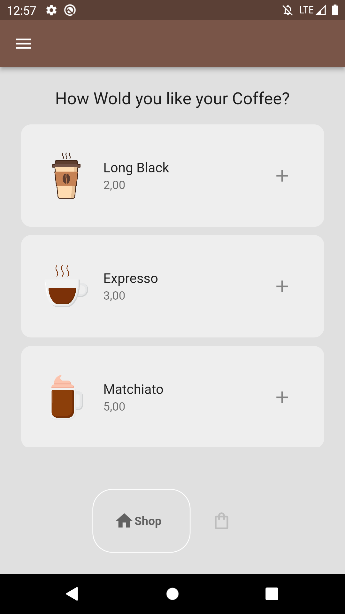
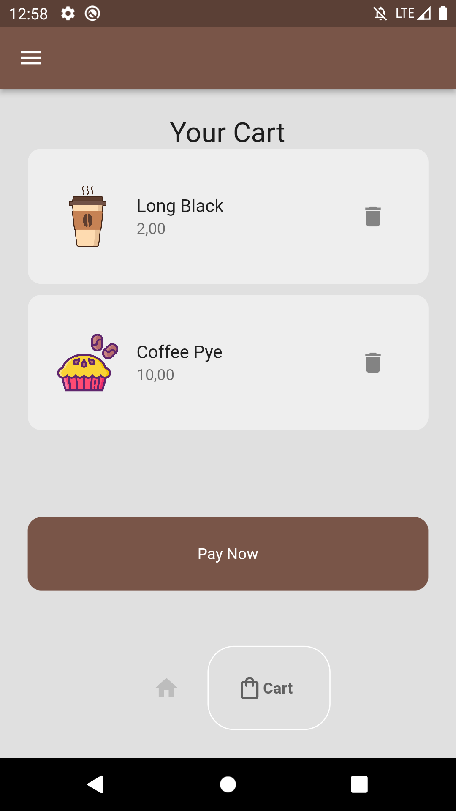

# CoffeeHouse

CoffeeHouse é um aplicativo de amostra para demonstrar o uso do Flutter na criação de uma interface de usuário de uma loja de café fictícia.

## Visão Geral

O aplicativo CoffeeHouse foi desenvolvido como parte de um projeto de aprendizado de Flutter. Ele oferece uma interface simples para navegar por uma lista de produtos de café e adicionar itens a um carrinho de compras simulado.

## Funcionalidades

- Exibe uma lista de produtos de café.
- Permite ao usuário adicionar produtos ao carrinho de compras.
- Permite ao usuário visualizar e limpar o carrinho de compras.
- Fornece uma interface amigável e intuitiva.

## Capturas de Tela





## Pré-requisitos

- Flutter SDK instalado (https://flutter.dev/docs/get-started/install)
- Um dispositivo Android ou iOS ou um emulador configurado

## Como Executar

1. Clone o repositório:

```bash
git clone https://github.com/MarcosPrintes001/CoffeeHouse.git
```
